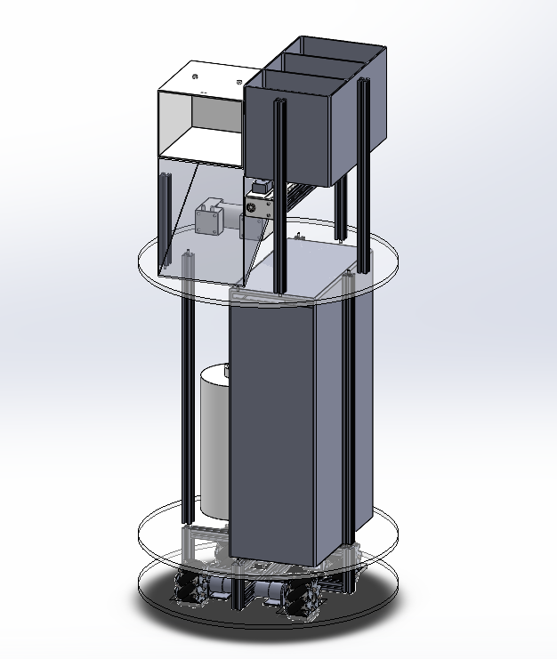
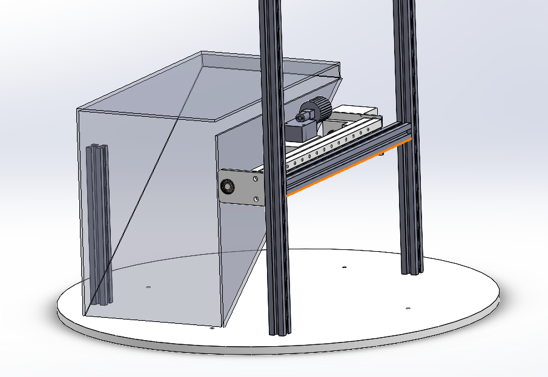
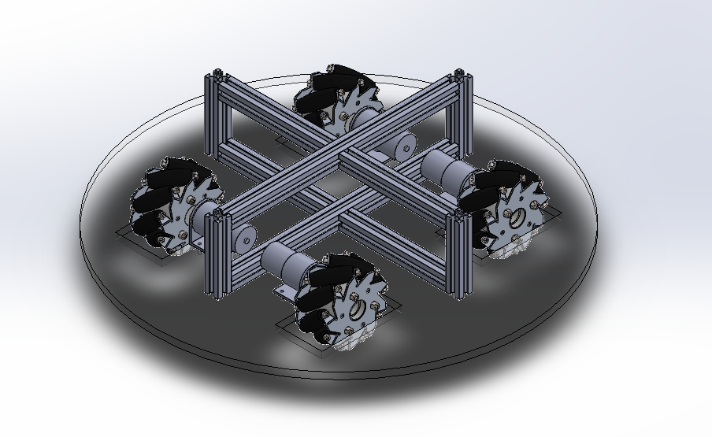

# Autonomous Mask Distribution & Recycling Robot  
**An Autonomous Mechatronic System for Public Health Protection in Large Venues**

---

## Project Overview

This project presents an autonomous mobile robot designed for mask distribution, used-mask collection, disinfection, and non-contact temperature screening in large public venues such as the Winter Olympics. The system aims to reduce secondary contamination risks, automate repetitive epidemic-prevention tasks, and improve operational efficiency through integrated mechatronic design.

---

## Engineering Motivation

Large public events involve high personnel density and complex human flow, significantly increasing epidemic prevention challenges. Improper disposal of used masks may cause secondary contamination, while existing mask distribution or recycling devices are typically stationary and single-function.

This project explores a mobile, multi-functional robotic solution that integrates mask management, health screening, and autonomous navigation into a single platform.

---

## System Architecture

The robot integrates the following subsystems:

- **Mobile Platform**
  - Mecanum-wheel chassis enabling omnidirectional motion  
  - Autonomous navigation with obstacle avoidance  

- **Mask Dispensing Module**
  - Motor-driven roller mechanism for single-mask delivery  
  - Infrared sensing to detect successful mask dispensing  
  - Modular and refillable mask box design  

- **Mask Recycling & Disinfection Module**
  - Used-mask collection bin with full-capacity detection  
  - Ultraviolet (UV) disinfection to reduce contamination risk  

- **Health Screening & Sanitization**
  - Non-contact infrared temperature measurement  
  - Automatic hand sanitization triggered by infrared sensors  

- **Control System**
  - Central controller coordinating all subsystems  
  - State-based control logic with event-driven transitions  
  - Support for return-to-base behavior under abnormal conditions  

---

## My Role & Contributions

- Participated in the overall system architecture design  
- Designed the mask dispensing and recycling mechanisms  
- Developed control logic based on state transitions and sensor feedback  
- Integrated sensing, actuation, and mobility subsystems  
- Conducted system-level design trade-off analysis  

---

## Control Logic

The robot behavior is implemented using a finite state machine (FSM) with the following main states:

1. Autonomous navigation  
2. Temperature measurement  
3. Mask dispensing  
4. Hand sanitization  
5. Mask recycling  
6. Return-to-base (triggered by low battery, empty mask supply, or full recycling bin)

This event-driven control strategy improves system robustness and safety during human–robot interaction.

---

## Mechanical & Mechatronic Design Highlights

- Modular mask box structure for easy replacement and maintenance  
- Motor and roller-based dispensing mechanism for reliable single-mask output  
- Infrared sensing for real-time detection of mask presence  
- UV-based disinfection for collected masks  
- Omnidirectional mobility using mecanum wheels  

---

## Engineering Highlights

- Multi-function epidemic prevention system integrated into a single mobile robot  
- Non-contact sensing to minimize secondary contamination  
- Autonomous navigation with adaptive stop-and-resume behavior  
- Scalable architecture enabling future multi-robot cooperation  
- System-level mechatronic integration suitable for real-world deployment  

---

## Tools & Skills

- Mechanical Design and 3D Modeling  
- Mechatronics System Integration  
- Sensors and Actuators  
- State-Based Control Logic  
- Autonomous Mobile Robot Design  

---

## Project Type

**System-Level Mechatronics and Automation Project**

---

## Project Media

- Presentation slides (PDF)  
- 3D model renders  

---

## Mechanical Design Preview

### System-Level Assembly

### Mask Dispensing Mechanism

### Omnidirectional Mobile Base

---

# 自动化口罩发放与回收机器人  
**面向大型公共场所的机电一体化防疫系统**

---

## 项目概述

本项目设计并实现了一种面向大型公共公共场所（如冬奥会场馆）的**自动化口罩发放与回收机器人**。系统集成了口罩发放、废弃口罩回收与消毒、非接触式测温、手部消毒以及自主移动等功能，旨在减少口罩使用过程中的二次污染风险，降低人工防疫成本，提高防疫工作的自动化与智能化水平。

---

## 工程背景与研究意义

在大型公共活动中，人流密集、人员结构复杂，防疫工作面临较大挑战。口罩作为最基本的防疫用品，其使用后的回收与处理问题如果考虑不周，容易引发二次传播风险。而现有的口罩发放或回收装置多为固定式设备，功能单一，灵活性不足。

本项目通过引入**移动机器人平台**，将口罩管理、健康筛查和消毒等功能集成于一体，探索一种更加高效、灵活的自动化防疫解决方案。

---

## 系统总体架构

该机器人系统主要由以下子系统组成：

- **移动底盘系统**
  - 采用麦克纳姆轮结构，实现全向移动能力  
  - 支持自主路径规划与避障功能  

- **口罩发放模块**
  - 基于减速电机与胶轮的单口罩发放机构  
  - 红外传感器检测口罩是否成功发放  
  - 模块化口罩盒设计，便于更换与补充  

- **口罩回收与消毒模块**
  - 设置废弃口罩投放口及可拆卸回收盒  
  - 回收盒满载检测功能  
  - 内置紫外线消毒装置，降低交叉感染风险  

- **健康检测与手部消毒模块**
  - 非接触式红外测温装置  
  - 基于红外感应的自动手部消毒系统  

- **控制系统**
  - 中央控制器协调各功能模块运行  
  - 基于状态机的控制逻辑与事件触发机制  
  - 支持电量不足、口罩耗尽、回收箱满载等条件下的自动回仓  

---

## 个人职责与贡献（重点）

- 参与机器人整体系统架构设计  
- 负责口罩发放与回收机构的方案设计  
- 设计基于状态转换的系统控制逻辑  
- 完成多传感器、多执行机构的系统集成  
- 参与系统级工程取舍分析与方案论证  

---

## 控制逻辑与状态机设计

系统控制采用**有限状态机（Finite State Machine, FSM）**方法，将机器人行为划分为以下主要状态：

1. 自主巡航与路径跟踪  
2. 人体测温状态  
3. 口罩发放状态  
4. 手部消毒状态  
5. 口罩回收状态  
6. 自动回仓状态（低电量、口罩耗尽、回收箱满载）

各状态之间通过传感器反馈与事件触发进行转换，提高系统的可靠性与人机交互安全性。

---

## 机械与机电设计特点

- 口罩盒模块化设计，便于维护与补充  
- 电机驱动胶轮结构，实现稳定可靠的单口罩输出  
- 多种红外传感器用于状态检测与安全判断  
- 紫外线消毒方式降低废弃口罩的污染风险  
- 基于麦克纳姆轮的全向移动底盘设计  

---

## 工程亮点总结

- 将口罩发放、回收、消毒与健康检测功能集成于单一移动平台  
- 采用非接触式传感方案，减少二次污染风险  
- 支持自主移动与自动回仓，提高系统连续运行能力  
- 具备扩展为多机器人协同作业系统的潜力  
- 适用于真实公共场所防疫场景的系统级机电一体化设计  

---

## 使用工具与能力

- 机械结构设计与三维建模  
- 机电一体化系统集成  
- 传感器与执行机构应用  
- 基于状态机的控制逻辑设计  
- 自动化系统工程思维  

---

## 项目类型定位

**系统级机电一体化与自动化工程项目**

---

## 项目资料

- 项目展示 PPT（PDF）  
- 三维模型效果图
